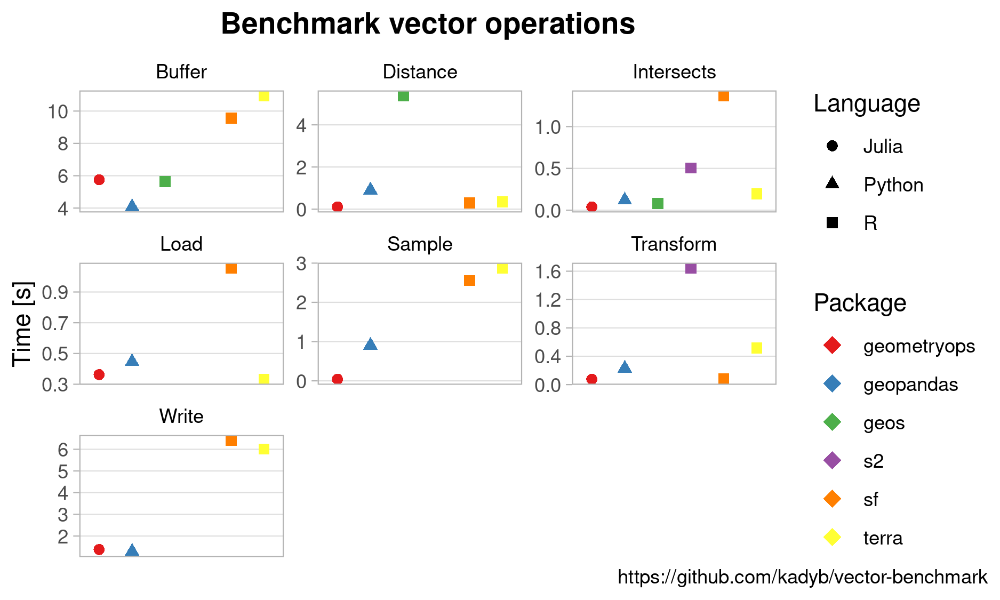

# Vector processing benchmarks
This repository contains a collection of vector processing benchmarks for Python and R packages.
The tests cover the most common operations such as loading and saving a geopackage file, sampling points in a polygon, creating buffers, transformating the coordinate system (CRS), calculating the distance between points, and intersecting geometries.

Note that all operations were performed in the Cartesian coordinate system excluding [s2](https://github.com/r-spatial/s2) package, where calculations were performed on the sphere (this may affects the longer calculation times).
For more information, see the "[Spherical geometry in sf using s2geometry](https://r-spatial.github.io/sf/articles/sf7.html)" article and [presentation](https://www.youtube.com/watch?v=zqRhF2XM1CE) at the FOSS4G 2021 conference.

It makes a huge difference to the operations performance in `{geopandas}` if the `{pygeos}` library is installed.
Its absence significantly slows down data processing.
`{pygeos}` is installed by default with version 2.0 of `{Shapely}`.



The detailed results are available at https://kadyb.github.io/vector-benchmark/report.html.

For high-performance data frames processing in R, check [data.table](https://grantmcdermott.com/fast-geospatial-datatable-geos/) and [collapse](https://sebkrantz.github.io/collapse/articles/collapse_and_sf.html).

You may also be interested in the [raster processing benchmarks](https://github.com/kadyb/raster-benchmark).

## Software
**Python**:
- [geopandas](https://github.com/geopandas/geopandas) (with [pygeos](https://pygeos.readthedocs.io/en/stable/))

**R**:
- [sf](https://github.com/r-spatial/sf)
- [terra](https://github.com/rspatial/terra)
- [s2](https://github.com/r-spatial/s2)
- [geos](https://github.com/paleolimbot/geos)

## Reproduction
1. Generate the data from `data/` folder in R.
2. Run all benchmarks using batch script (`run_benchmarks.sh`) or single benchmarks files.

**Batch script**
```
cd vector-benchmark
./run_benchmarks.sh
```

**Single benchmark**
```
Rscript sf/buffer.R
```

```
python3 geopandas/buffer.py
```

## Dataset
The dataset is synthetically generated and consists of 300,000 points in a planar coordinate system.

## Hardware configuration
- CPU: Intel Xeon CPU E5-2620 v2 @ 2.10GHz
- RAM: 64 GB
- OS: Pop!_OS 20.04 LTS
